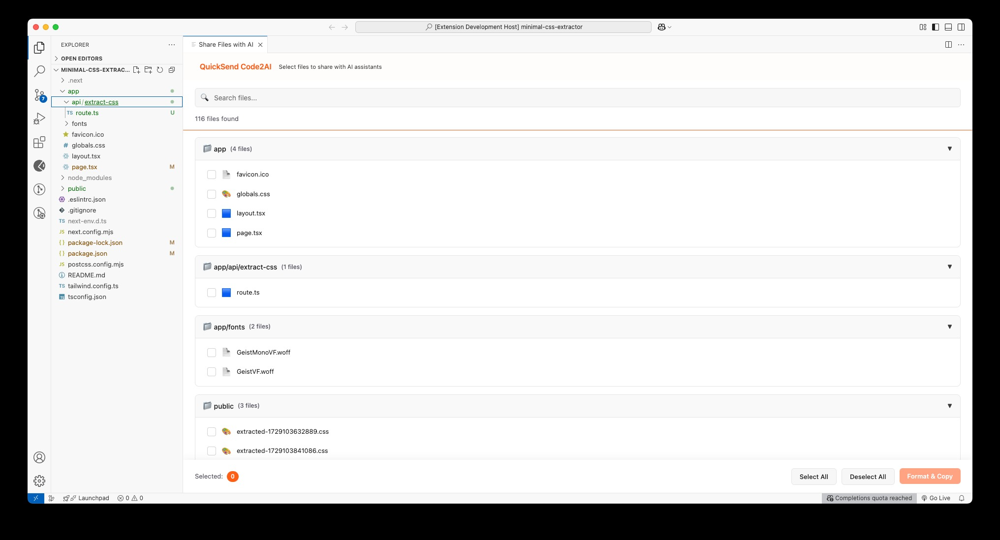

## QuickSend Code2AI - Share Code with AI Assistants

[](https://marketplace.visualstudio.com/items?itemName=ParekhDhruv.quicksend-code2ai) [](https://marketplace.visualstudio.com/items?itemName=ParekhDhruv.quicksend-code2ai) [](https://marketplace.visualstudio.com/items?itemName=ParekhDhruv.quicksend-code2ai)

**Share multiple code files with ChatGPT, Claude & Gemini directly from VS Code. Format & copy code to AI assistants with one click.**

QuickSend Code2AI makes sharing code with ChatGPT, Claude, and other AI coding assistants effortless. Stop copying files one by one - select multiple files, format them properly, and send them directly to any AI assistant in seconds. Perfect for getting AI help with debugging, code reviews, and learning programming concepts.


## ✨ Why Use QuickSend Code2AI?

- **Save Time**: Share multiple files in seconds instead of minutes
- **Improve AI Responses**: Properly formatted code leads to better AI assistance
- **Enhance Workflow**: Seamlessly integrate VS Code with your favorite AI tools
- **Boost Productivity**: Get faster, more accurate help from AI assistants

## 🔥 Key Features

- 🔄 **Universal AI Support**: Works with ChatGPT, Claude, Gemini, Bard, and any text-based AI tool
- 📋 **One-Click Multi-File Sharing**: Select and copy multiple files with a single click
- 🔍 **Intelligent File Browser**: Quickly navigate, search, and select files from your workspace
- 📂 **Hierarchical Organization**: Files are neatly organized by folder structure for context
- 📊 **Complete File Type Support**: Share code, configs, documentation, and any file type
- 🎨 **AI-Optimized Formatting**: Code is properly formatted with syntax highlighting markers
- ⚡ **Performance Optimized**: Minimal impact on VS Code performance

## 📸 See It In Action



## 🚀 Installation

Install directly from the VS Code Marketplace:

1. Open VS Code
2. Go to Extensions (Ctrl+Shift+X / Cmd+Shift+X)
3. Search for "QuickSend Code2AI"
4. Click Install

Alternatively, install using the VS Code Quick Open (Ctrl+P / Cmd+P):

```
ext install ParekhDhruv.quicksend-code2ai
```

## 🔧 How to Use

1. **Launch the File Selector**:
   - Right-click in Explorer and select "Share Files with AI Assistant"
   - Or use Command Palette (Ctrl+Shift+P / Cmd+Shift+P) and type "Share Files with AI Assistant"

2. **Select Your Files**:
   - Browse through your workspace files in the intuitive file selector
   - Check the files you want to share with your AI assistant
   - Use the search feature to quickly find specific files

3. **Format & Copy to Clipboard**:
   - Click the "Format & Copy" button
   - All selected files will be formatted with proper syntax highlighting and copied to your clipboard

4. **Paste to Your AI Assistant**:
   - Switch to your AI assistant (ChatGPT, Claude, Gemini, etc.)
   - Paste the content (Ctrl+V / Cmd+V)
   - Ask your question about the code

## 💡 Perfect Use Cases

- **AI Code Reviews**: Share multiple files for comprehensive code reviews
- **Error Debugging**: Provide complete context by sharing both your code and error logs
- **Refactoring Assistance**: Let AI assistants help optimize and improve your code
- **Learning Programming**: Get explanations of complex code structures and patterns
- **Smart Code Generation**: Show examples to get better AI-generated code recommendations
- **Technical Documentation**: Generate documentation for your code with proper context

## ⚙️ Configuration Options

QuickSend Code2AI offers these customizable settings:

* `quicksend-code2ai.excludeDirectories`: Directories to exclude from file selection (default: "node_modules, .git")
* `quicksend-code2ai.maxFileSizeKB`: Maximum file size in KB to include (default: 500)

## 📋 AI-Optimized Output Format

Files are copied in a markdown-compatible format that works perfectly with AI assistants:

```
## File: example.js
```javascript
// Your code is formatted like this
function example() {
  console.log("Hello World");
}
```

## File: styles.css
```css
body {
  font-family: Arial, sans-serif;
}
```
```

## 🔄 Why Choose QuickSend Code2AI?

| Feature | QuickSend Code2AI | Manual Copy-Paste | Other Extensions |
|---------|-------------------|-------------------|------------------|
| Multi-file support | ✅ | ❌ | ⚠️ Limited |
| All file types | ✅ | ✅ | ⚠️ Some |
| AI-optimized formatting | ✅ | ❌ | ⚠️ Varies |
| Search functionality | ✅ | ❌ | ⚠️ Some |
| Directory navigation | ✅ | ❌ | ⚠️ Limited |
| Works with all AI assistants | ✅ | ✅ | ⚠️ Some |
| Time saved per session | 5-15 minutes | 0 minutes | 2-5 minutes |

## ❓ Frequently Asked Questions

### Which AI assistants does this work with?
QuickSend Code2AI works with any text-based AI assistant including ChatGPT, Claude, Gemini, Bard, Copilot, and any other AI tool that accepts pasted text.

### Is there a limit to how many files I can share?
There's no built-in limit, but AI assistants typically have context limits. For best results, we recommend sharing 5-15 files at once depending on file size.

### Does this work with all programming languages?
Yes! QuickSend Code2AI supports all file types and programming languages supported by VS Code.

### How do I request features or report bugs?
Please visit our [GitHub repository](https://github.com/dhruv0127/QuickSend-All-Files) to open issues or submit feature requests.

### Is this extension free?
Yes, QuickSend Code2AI is completely free and open-source.

## 🔗 Resources

- [GitHub Repository](https://github.com/dhruv0127/QuickSend-All-Files)
- [VS Code Marketplace](https://marketplace.visualstudio.com/items?itemName=ParekhDhruv.quicksend-code2ai)
- [Report Issues](https://github.com/dhruv0127/QuickSend-All-Files/issues)
- [Feature Requests](https://github.com/dhruv0127/QuickSend-All-Files/issues/new?labels=enhancement)

## 📝 License

This project is licensed under the MIT License